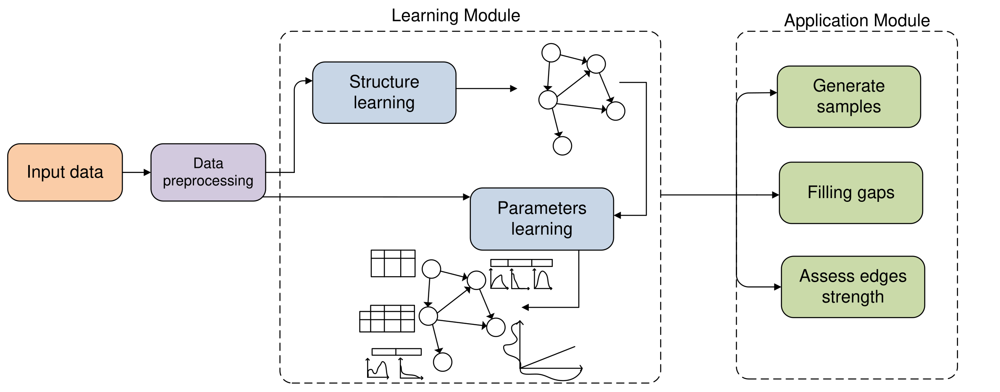
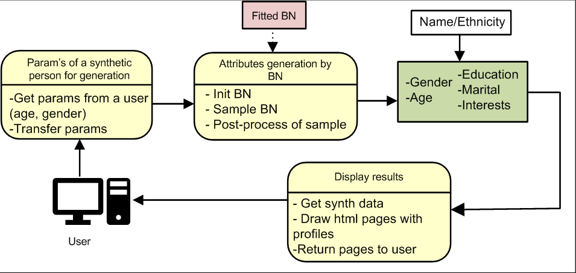

# BAMT - Bayesian Analytical and Modelling Toolkit

Repository of a data modeling and analysis tool based on Bayesian networks.

## Badges

| team       |   |
|------------|-----------------------------------------------------------------------------------------------------------------------------------------------------------------------------------------------------------------------------------------------------|
| package    |                                |
| tests      |                                                     |
| docs       |                                                                                                                                                               |
| license    |                                                                                                                                                                               |
| stats      |    |
| style      |                                                                                                                                                                                |

## Introduction

BAMT - Bayesian Analytical and Modelling Toolkit. This repository contains a data modeling and analysis tool based on Bayesian networks. It can be divided into two main parts - algorithms for constructing and training Bayesian networks on data and algorithms for applying Bayesian networks for filling gaps, generating synthetic data, assessing edge strength, etc.



## Installation

BAMT package is available via PyPi:

```bash
pip install bamt
```

## BAMT Features

The following algorithms for Bayesian Networks learning are implemented:

- Building the structure of a Bayesian network based on expert knowledge by directly specifying the structure of the network.
- Building the structure of a Bayesian network on data using three algorithms - Hill Climbing, evolutionary, and PC (PC is currently under development). For Hill Climbing, the following score functions are implemented - MI, K2, BIC, AIC. The algorithms work on both discrete and mixed data.
- Learning the parameters of distributions in the nodes of the network based on Gaussian distribution and Mixture Gaussian distribution with automatic selection of the number of components.
- Non-parametric learning of distributions at nodes using classification and regression models.
- BigBraveBN - algorithm for structural learning of Bayesian networks with a large number of nodes. Tested on networks with up to 500 nodes.

### Difference from existing implementations:

- Algorithms work on mixed data.
- Structural learning implements score-functions for mixed data.
- Parametric learning implements the use of a mixture of Gaussian distributions to approximate continuous distributions.
- Non-parametric learning of distributions with various user-specified regression and classification models.
- The algorithm for structural training of large Bayesian networks (> 10 nodes) is based on local training of small networks with their subsequent algorithmic connection.


For example, in terms of data analysis and modeling using Bayesian networks, a pipeline has been implemented to generate synthetic data by sampling from Bayesian networks.



## How to use

Then the necessary classes are imported from the library:

```python
from bamt.networks.hybrid_bn import HybridBN
```

Next, a network instance is created and training (structure and parameters) is performed:

```python
bn = HybridBN(has_logit=False, use_mixture=True)
bn.add_edges(preprocessed_data)
bn.fit_parameters(data)
```

## Examples & Tutorials

More examples can be found in [Documentation](https://bamt.readthedocs.io/en/latest/examples/learn_save.html).

## Publications about BAMT

We have published several articles about BAMT:

- [Advanced Approach for Distributions Parameters Learning in Bayesian Networks with Gaussian Mixture Models and Discriminative Models](https://www.mdpi.com/2227-7390/11/2/343) (2023)
- [BigBraveBN: algorithm of structural learning for bayesian networks with a large number of nodes](https://www.sciencedirect.com/science/article/pii/S1877050922016945) (2022)
- [MIxBN: Library for learning Bayesian networks from mixed data](https://www.sciencedirect.com/science/article/pii/S1877050921020925) (2021)
- [Oil and Gas Reservoirs Parameters Analysis Using Mixed Learning of Bayesian Networks](https://link.springer.com/chapter/10.1007/978-3-030-77961-0_33) (2021)
- [Bayesian Networks-based personal data synthesis](https://dl.acm.org/doi/abs/10.1145/3411170.3411243) (2020)

## Project structure

The latest stable version of the library is available in the master branch.

It includes the following modules and directories:

- [bamt](https://github.com/ITMO-NSS-team/BAMT/tree/master/bamt) - directory with the framework code:
    - Preprocessing - module for data preprocessing
    - Networks - module for building and training Bayesian networks
    - Nodes - module for nodes support of Bayesian networks
    - Utilities - module for mathematical and graph utilities
- [data](https://github.com/ITMO-NSS-team/BAMT/tree/master/data) - directory with data for experiments and tests
- [tests](https://github.com/ITMO-NSS-team/BAMT/tree/master/tests) - directory with unit and integration tests
- [tutorials](https://github.com/ITMO-NSS-team/BAMT/tree/master/tutorials) - directory with tutorials
- [docs](https://github.com/ITMO-NSS-team/BAMT/tree/master/docs) - directory with RTD documentation

### Preprocessing

Preprocessor module allows users to transform data according to the pipeline (similar to the pipeline in scikit-learn).

### Networks

Three types of networks are implemented:

- HybridBN - Bayesian network with mixed data
- DiscreteBN - Bayesian network with discrete data
- ContinuousBN - Bayesian network with continuous data

They are inherited from the abstract class BaseNetwork.

### Nodes

Contains classes for nodes of Bayesian networks.

### Utilities

Utilities module contains mathematical and graph utilities to support the main functionality of the library.

## Web-BAMT

A web interface for BAMT is currently under development. The repository is available at [web-BAMT](https://github.com/aimclub/Web-BAMT).

## Contacts

If you have questions or suggestions, you can contact us at the following address: ideeva@itmo.ru (Irina Deeva)

Our resources:

- [Natural Systems Simulation Team](https://itmo-nss-team.github.io/)
- [NSS team Telegram channel](https://t.me/NSS_group)
- [NSS lab YouTube channel](https://www.youtube.com/@nsslab/videos)

## Citation

```bibtex
@misc{BAMT,
  author={BAMT},
  title = {Repository experiments and data},
  year = {2021},
  publisher = {GitHub},
  journal = {GitHub repository},
  howpublished = {\url{https://github.com/ITMO-NSS-team/BAMT.git}},
  url = {https://github.com/ITMO-NSS-team/BAMT.git}
}

@article{deeva2023advanced,
  title={Advanced Approach for Distributions Parameters Learning in Bayesian Networks with Gaussian Mixture Models and Discriminative Models},
  author={Deeva, Irina and Bubnova, Anna and Kalyuzhnaya, Anna V},
  journal={Mathematics},
  volume={11},
  number={2},
  pages={343},
  year={2023},
```
